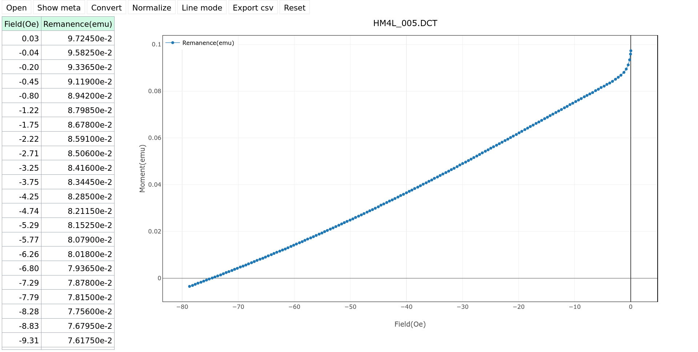
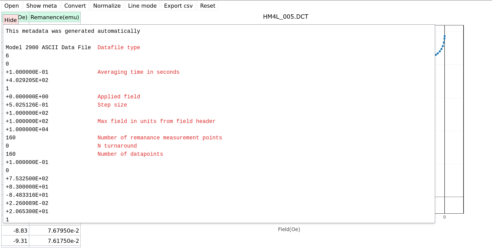
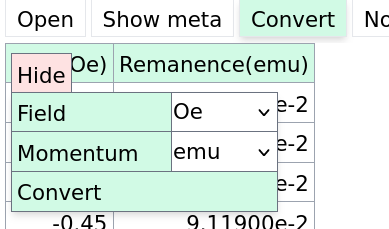
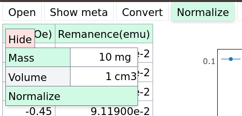

# t3conv

A web service for read data from LS7400VSM and Princeton. The app is hosted here: https://t3conv.vercel.app/.
Also check out the [documentation](https://t3conv.vercel.app/docs). You can test out the app with on
`test_files/HM4L_005.DCT` in `Princeton` mode.

## Features

The main features are

- Converting between units of measurements
- Normalizing experimental data
- Exporting the result in `csv`

## Screenshots

Main view

File metadata 

Unit conversion

Normalization

